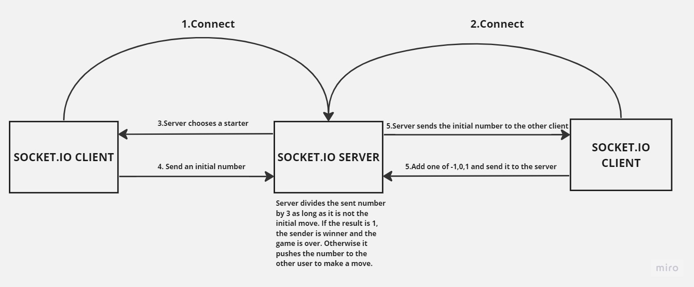

# Game of Three

## Description
A socket.io based two-players game project including both server and client side.




## Installation and Running

### Install
1. You need to have Node.js installed in your system.

2. Install the packages.:
```bash
npm install
```
And that's it. You are ready to run the application.

### Run the Application and Play
The application has both server and client side code. You need to run both of them to play the game.
1. Create a .env file in the root of the repository and fill it with the values in the .env.example file.
You can alternatively change the values.

2.Run a single server instance.
```bash
npm run runServer
```
3.Run two client instances.
```bash
npm run runClient
```
    
You can run as many client instances as you want. But the game is designed to be played with two players.
As soon as two players are connected, the game starts. Please follow the instructions on the client terminal screen
to play the game.

### Run the Tests
1. Create a test.env file in the root of the repository and fill it with the values in the .env.example file.
You can alternatively change the values.
2. You can run the tests with the following command:
```bash
npm run test
```